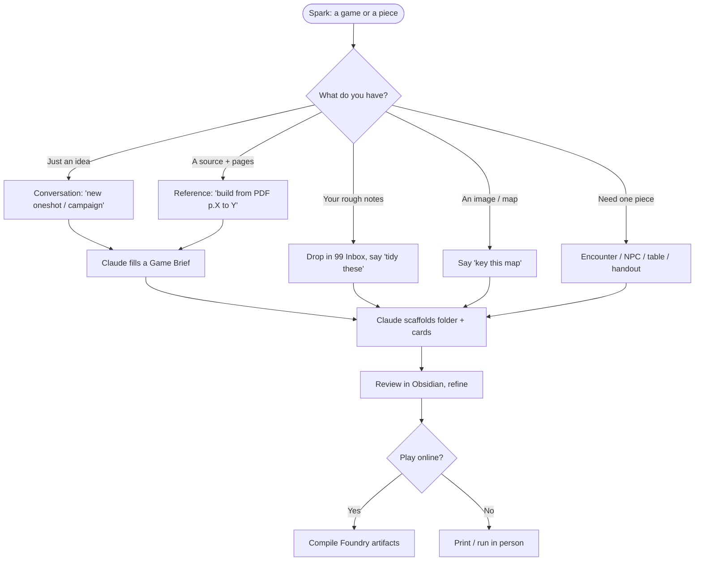

# Running a new game

Your launchpad. Turn any spark — an idea, a source, rough notes, an image, or
just "I need an encounter" — into **table-ready vault notes** (and optional
**Foundry content**). Pick a lane below.

## Workflow



## Quick start — buttons

Spawn the starting card, then tell Claude to build it. *(Needs Buttons +
Templater configured — see [[_Plugins Setup]].)*

```button
name 🎲 New Game Brief
type note(99 Inbox/New Game Brief, split) template
action New Game Brief Template
templater true
```
```button
name ⚔️ New Encounter
type note(99 Inbox/New Encounter, split) template
action Encounter Template
templater true
```
```button
name 🧑 New NPC
type note(99 Inbox/New NPC, split) template
action NPC Template
templater true
```
```button
name 🎲 New Roll Table
type note(99 Inbox/New Roll Table, split) template
action Roll Table Template
templater true
```
```button
name 🗺️ New Map Brief
type note(99 Inbox/New Map Brief, split) template
action Map Brief Template
templater true
```

## Quick start — say it to Claude

Copy a line, fill the `<…>`, send it:

```text
new oneshot — dnd5e, 4 players, level <N>, ~3h, tone <…>. Interview me.
```
```text
build a oneshot from [[<a source PDF>]] p.<A>-<B>.
```
```text
tidy my rough notes in 99 Inbox/<name>/ into a oneshot.
```
```text
key this map: ![[<map>.png]] — rooms, features, an encounter or two.
```
```text
build an encounter: 4x level-<N> in <place>, <easy/medium/hard>.
```
```text
make a 1d8 <rumors/loot/complications> table for <game>.
```
```text
fill the statblock on [[<NPC>]] — around CR <X>, <flavour>.
```
```text
session recap: <what happened> — write the recap and prep next session.
```
```text
map for [[<location>]] — generate player + DM battlemaps (+ .dd2vtt) from the notes.
```

## Creation cases (catalog)

| You give | You get | Start with |
|---|---|---|
| An idea | Full game (interviewed) | "new oneshot/campaign" |
| A source + pages | Game built from it | "build from [[PDF]] p.X–Y" |
| Your rough notes | Tidied structured notes | "tidy 99 Inbox/…" |
| A map/image | Keyed location note | "key this map ![[…]]" |
| A location note | Player + DM battlemaps + `.dd2vtt` (generated) | "map for [[…]]" |
| A creature need | NPC / statblock card | "fill statblock" / "reskin SRD …" |
| Party + place | Balanced encounter | "encounter: 4× L4 in …" |
| A theme | Roll table / generator | "1d8 rumors table for …" |
| A prop idea | Player handout | "write the letter/notice/riddle …" |
| Post-session | Recap + next-session prep | "session recap: …" |
| Existing content | Reskin / scale / sequel | "scale <your game> to L5" |
| A concept | Faction / region / pantheon | "build the … faction" |
| A oneshot | Ready-to-run pregens | "make 5 L3 pregens" |
| Another system | Converted prep | "convert … to Cairn" |
| A loose pile | Cross-links + MOC | "link and index …" |

## The three build modes (detail)

- **Conversation** — Claude asks for system, level, players, runtime, tone,
  premise, structure, cast, locations, set-pieces, bespoke mechanics; fills a
  **[[New Game Brief Template|Game Brief]]**; confirms; builds.
- **Reference** — cite the note/PDF **and page numbers**; Claude reads those
  exact pages, drafts, and flags gaps. (External sites may need a paste.)
- **Your notes** — drop in `99 Inbox/<name>/`; Claude reshapes them (strip cruft,
  add frontmatter, split into cards).

## What Claude produces
A finished folder (`03 Oneshots/<Name>/` or `02 Campaigns/<Name>/`) in the house
style: index/MOC, GM prep, scene/POI notes, NPC cards (Fantasy Statblocks),
handouts, `Assets/`, Dataview auto-index.

## Then (optional): Foundry content
Compile the cards to Foundry compendium JSON — see
[[How this vault works#Foundry pipeline]].

## The loop
Claude drafts → you review in Obsidian → say what to change → Claude refines.

Back to [[Home]].
